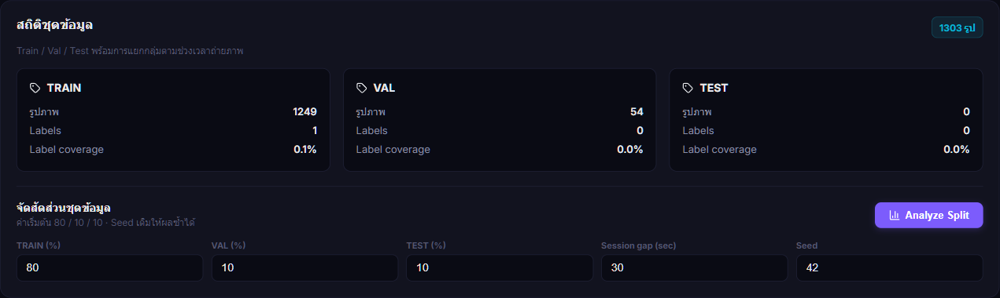
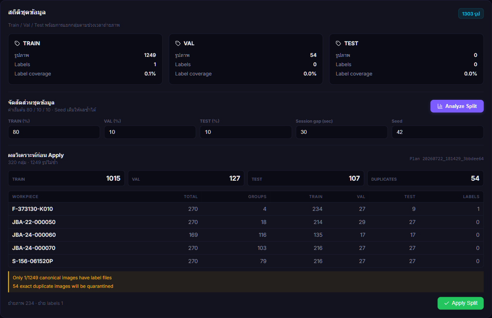
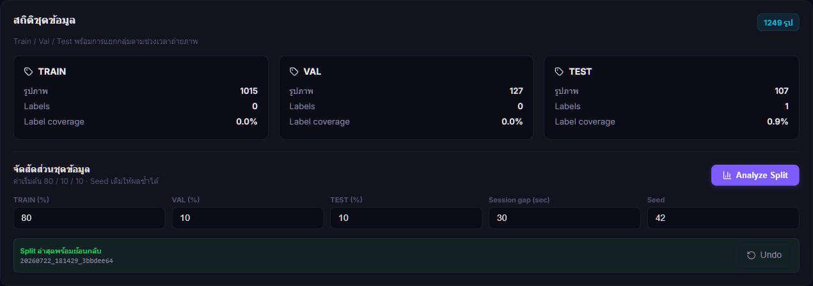
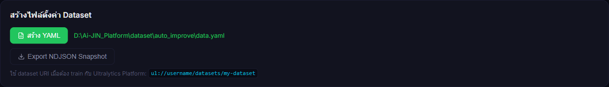
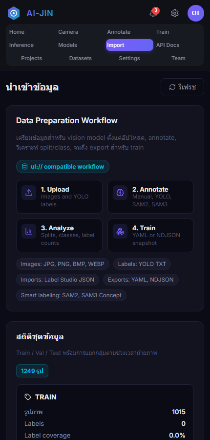

# คู่มือการแบ่งชุดข้อมูล Train / Val / Test

**ระบบ:** Ai-JIN Platform

**โมดูล:** Data Import - Group-aware Dataset Split

**ฉบับ:** 1.0 - 22 กรกฎาคม 2026

**เส้นทางระบบ:** `D:\Ai-JIN_Platform`

---

## 1. วัตถุประสงค์

คู่มือนี้อธิบายวิธีแบ่งภาพเป็นชุด Train, Validation และ Test โดยลดโอกาสที่ภาพซึ่งถ่ายต่อเนื่องจากชิ้นงานเดียวกันจะกระจายข้ามชุดข้อมูล ระบบใช้เวลาในชื่อไฟล์และช่วงห่างของการถ่ายภาพ (session gap) เพื่อรวมภาพเป็น capture group ก่อนจัดสัดส่วน

ผลที่ต้องการ:

- Train ใช้เรียนรู้พารามิเตอร์ของโมเดล
- Val ใช้ปรับแต่งและติดตามผลระหว่างการฝึก
- Test ใช้ประเมินโมเดลหลังฝึกโดยต้องไม่รั่วไหลจาก Train/Val
- ภาพซ้ำแบบไบต์เหมือนกันถูกแยกไป quarantine ไม่ลบทิ้ง
- ทุกการ Apply มี manifest สำหรับตรวจสอบและ Undo

> **ข้อสำคัญ:** การแบ่งชุดข้อมูลที่ดีไม่ทดแทน annotation ปัจจุบันมี label เพียง 1 ไฟล์จาก 1,249 ภาพ จึงยังไม่พร้อมสำหรับการฝึกโมเดลจริง

## 2. ขอบเขตโฟลเดอร์

Ai-JIN Platform และ App AI Camera ถูกแยกความรับผิดชอบชัดเจน:

| ส่วนงาน | โฟลเดอร์หลัก | หน้าที่ |
|---|---|---|
| Ai-JIN Platform | `D:\Ai-JIN_Platform` | Web UI, annotation, dataset, train, inference และ models |
| App AI Camera | `D:\Ai-JIN_V10.0_patch_output` | โปรแกรมกล้อง PyQt5, tracking, PLC และ production runtime |
| Platform legacy archive | `D:\Ai-JIN_Platform\legacy\v10-platform-stack-20260722` | สำเนา Platform เดิมที่ย้ายออกจาก App AI Camera |

Platform ใช้ runtime paths ต่อไปนี้:

- Dataset: `D:\Ai-JIN_Platform\dataset`
- Training runs: `D:\Ai-JIN_Platform\runs`
- Models: `D:\Ai-JIN_Platform\models`

ห้ามนำโค้ดหรือข้อมูล Platform กลับไปไว้ใน `D:\Ai-JIN_V10.0_patch_output`

## 3. เปิดหน้าจัดการข้อมูล

1. เปิด Chrome
2. เข้า `http://localhost:8501/import`
3. เลื่อนมาที่หัวข้อ **สถิติชุดข้อมูล**
4. ตรวจจำนวนภาพและ label ของ Train / Val / Test

**ภาพที่ 1:** การ์ดสถิติและค่าตั้งต้นสำหรับการวิเคราะห์ split

## 4. ค่าที่แนะนำ

| ค่า | ค่าแนะนำ | ความหมาย |
|---|---:|---|
| Train | 80% | ข้อมูลหลักสำหรับฝึก |
| Val | 10% | ข้อมูลสำหรับประเมินระหว่างฝึก |
| Test | 10% | ข้อมูลที่กันไว้ทดสอบขั้นสุดท้าย |
| Session gap | 30 วินาที | ภาพของ workpiece เดียวกันที่ห่างไม่เกินค่านี้อยู่ capture group เดียวกัน |
| Seed | 42 | ทำให้การจัดกลุ่มซ้ำได้ผลเดิม |

อัตราส่วนทั้งสามต้องรวมเป็น 100% และค่าทุกช่องต้องมากกว่า 0

## 5. วิเคราะห์ก่อนย้ายไฟล์

1. ใส่สัดส่วนและค่า session gap
2. กด **Analyze Split**
3. ระบบจะสแกนภาพ, hash ไฟล์, อ่าน workpiece จากชื่อไฟล์ และสร้าง capture groups
4. ตรวจผล Proposed Total และตาราง Breakdown by workpiece
5. อ่านคำเตือนทั้งหมดก่อน Apply

**ภาพที่ 2:** Preview แสดงจำนวนเป้าหมาย, จำนวนกลุ่ม, งานย้ายไฟล์ และคำเตือน

สิ่งที่ต้องตรวจ:

- **Canonical images** คือภาพไม่ซ้ำที่นำไปแบ่งชุด
- **Exact duplicates** คือภาพซ้ำที่ระบบจะย้ายไป quarantine
- **Groups** คือจำนวน capture groups ซึ่งจะไม่ถูกแยกข้าม split
- **Image moves / Label moves** คือจำนวนไฟล์ที่จะถูกย้าย
- ตาราง workpiece ต้องมี Train / Val / Test ครบตามความเหมาะสม
- Label coverage ต่ำต้องแก้ด้วยการ annotate ไม่ใช่ย้าย label ข้ามกลุ่มเอง

## 6. ยืนยันและ Apply

1. เมื่อ preview ถูกต้อง กด **Apply Split**
2. อ่านข้อความยืนยันจำนวนไฟล์ที่จะย้าย
3. ยืนยันการดำเนินการ
4. รอจนแสดง manifest ID และปุ่ม **Undo**
5. ห้ามแก้ไขหรือย้ายไฟล์ dataset ด้วยตนเองระหว่าง Apply

**ภาพที่ 3:** สถานะหลัง Apply พร้อม manifest ล่าสุดและ Undo

ผลจริงของ dataset ณ วันที่จัดทำคู่มือ:

| Split | ภาพ | Label | สัดส่วนภาพ |
|---|---:|---:|---:|
| Train | 1,015 | 0 | 81.3% |
| Val | 127 | 0 | 10.2% |
| Test | 107 | 1 | 8.6% |
| **รวม** | **1,249** | **1** | **100%** |

Manifest ที่ Apply: `20260722_181429_3bbdee64`

ผลตรวจความถูกต้อง:

- Exact duplicates ใน active dataset: 0
- SHA ที่ซ้ำข้าม split: 0
- Capture groups ทั้งหมด: 320
- Capture groups ที่รั่วข้าม split: 0
- ภาพซ้ำที่ quarantine: 54

## 7. สร้าง Dataset YAML

1. เลื่อนไปหัวข้อ **สร้างไฟล์ตั้งค่า Dataset**
2. กด **สร้าง YAML**
3. ตรวจ path ที่ระบบแจ้ง
4. เปิดไฟล์ `D:\Ai-JIN_Platform\dataset\auto_improve\data.yaml`
5. ตรวจว่ามี `train`, `val`, `test`, `nc` และ `names`

**ภาพที่ 4:** ระบบยืนยันการสร้าง YAML ในโฟลเดอร์ Platform

ระบบพบคลาสจาก workpiece folders จำนวน 5 คลาส:

1. F-373130-K010
2. JBA-22-000050
3. JBA-24-000060
4. JBA-24-000070
5. S-156-061520P

## 8. Undo และการกู้คืน

ใช้ Undo เมื่อพบว่าสัดส่วนหรือการจัดกลุ่มไม่เหมาะสม:

1. หยุดการ annotate, upload และ train ที่ใช้ dataset นี้
2. เปิดหน้า Import
3. ตรวจ manifest ID ล่าสุด
4. กด **Undo**
5. ยืนยันการย้อนกลับ
6. ตรวจจำนวนภาพทั้งสาม split อีกครั้ง

Undo จะใช้ manifest เดิมเพื่อย้ายภาพ/label กลับ และนำภาพจาก quarantine คืนตำแหน่งเดิม หากมีไฟล์ใหม่ชนกับปลายทาง ระบบจะหยุดพร้อมแจ้ง conflict เพื่อป้องกันข้อมูลสูญหาย

ตำแหน่งหลักฐาน:

- Manifest: `dataset/auto_improve/split_manifests`
- Quarantine: `dataset/auto_improve/split_quarantine/<manifest_id>`

ห้ามลบสองโฟลเดอร์นี้จนกว่าจะยืนยันว่าไม่ต้อง Undo

## 9. ใช้งานบนมือถือ

หน้า Import รองรับ viewport แคบ แถบเมนูด้านบนเลื่อนแนวนอนได้ และเนื้อหาหลักใช้เต็มความกว้าง

**ภาพที่ 5:** Chrome viewport 430 x 900 หลังแก้ responsive layout

สำหรับการ Apply จริง แนะนำใช้จอเดสก์ท็อปเพื่ออ่านตาราง workpiece และคำเตือนได้ครบถ้วน

## 10. เกณฑ์พร้อมฝึกโมเดล

ก่อนเริ่ม Train ต้องผ่านรายการต่อไปนี้:

- [ ] ภาพทุกภาพที่ใช้ฝึกมี YOLO label ถูกต้อง
- [ ] ตรวจกรอบให้ชิดชิ้นงาน และไม่มี class ผิด
- [ ] Label coverage ของ Train และ Val อยู่ในระดับที่ยอมรับได้
- [ ] ไม่มีภาพซ้ำข้าม split
- [ ] ไม่มี capture group รั่วข้าม split
- [ ] ทุก class มีตัวอย่างเพียงพอใน Train และ Val
- [ ] Test ไม่ถูกนำไปใช้ปรับค่าโมเดล
- [ ] เปิดตรวจ `data.yaml` แล้ว path และ class names ถูกต้อง

**สถานะปัจจุบัน:** ยังไม่ผ่าน เนื่องจาก label coverage รวมเท่ากับ 1 / 1,249 ภาพ

## 11. การแก้ปัญหา

| อาการ | สาเหตุที่เป็นไปได้ | วิธีดำเนินการ |
|---|---|---|
| 400 Bad Request | สัดส่วนไม่รวม 100 หรือค่าติดลบ/เป็นศูนย์ | แก้ Train + Val + Test ให้รวม 100 |
| 409 Conflict | dataset เปลี่ยนหลัง Analyze หรือมีไฟล์ปลายทางชนกัน | รีเฟรชหน้าแล้ว Analyze ใหม่ ห้ามเขียนทับด้วยตนเอง |
| 500 Internal Server Error | path, permission หรือไฟล์ผิดรูปแบบ | ตรวจ log ของ Platform และยืนยันว่า path อยู่ใต้ `D:\Ai-JIN_Platform` |
| Apply ไม่สำเร็จ | ไฟล์ถูกโปรแกรมอื่นล็อก | ปิดโปรแกรมที่เปิดไฟล์ dataset แล้วลอง Analyze ใหม่ |
| YAML มี nc = 0 | ไม่พบ workpiece/class จากโครงสร้างไฟล์ | ตรวจชื่อโฟลเดอร์และชื่อไฟล์ แล้วกดสร้าง YAML ใหม่ |
| Train ไม่มี label | ยังไม่ได้ annotate หรือ label อยู่ผิด split | ใช้ Annotator สร้าง/ตรวจ label ก่อน Train |
| ต้องย้อนกลับ | split ไม่เหมาะสม | ใช้ Undo ของ manifest ล่าสุด ห้ามย้ายไฟล์ด้วย Explorer |

## 12. API สำหรับผู้ดูแลระบบ

| Method | Endpoint | หน้าที่ |
|---|---|---|
| GET | `/api/import/split-info` | อ่านสถิติชุดข้อมูล |
| POST | `/api/import/split/preview` | สร้างแผนโดยยังไม่ย้ายไฟล์ |
| POST | `/api/import/split/apply` | Apply แผนที่ผ่าน preflight |
| GET | `/api/import/split/latest` | อ่าน manifest ล่าสุด |
| POST | `/api/import/split/undo` | ย้อนกลับ manifest ล่าสุด |
| POST | `/api/import/generate-yaml` | สร้าง `data.yaml` |

ระบบตรวจ SHA และสถานะต้นทางก่อน Apply เพื่อป้องกันการใช้ preview ที่เก่าแล้ว

---

**เอกสารอ้างอิง:** `docs/platform-boundary.md`

**เจ้าของระบบ Platform:** `D:\Ai-JIN_Platform`

**App AI Camera:** `D:\Ai-JIN_V10.0_patch_output`
