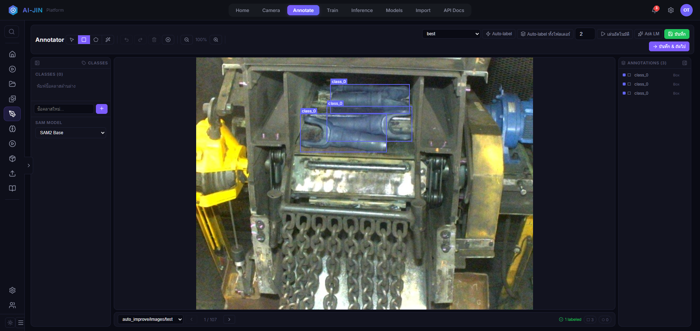
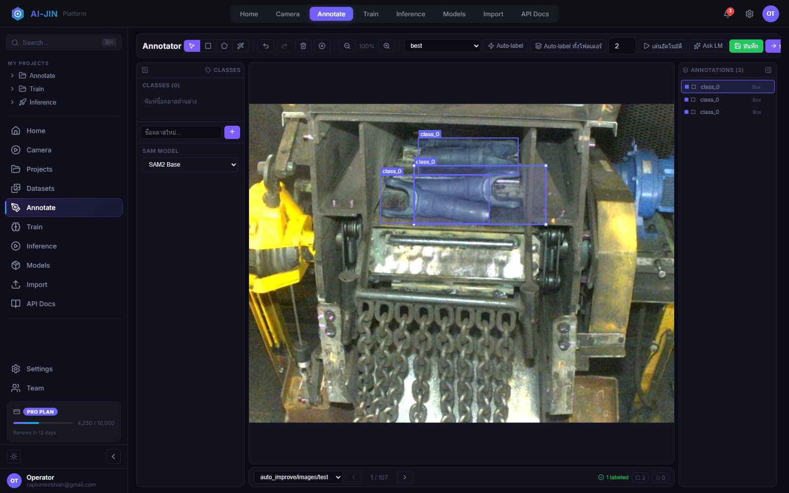
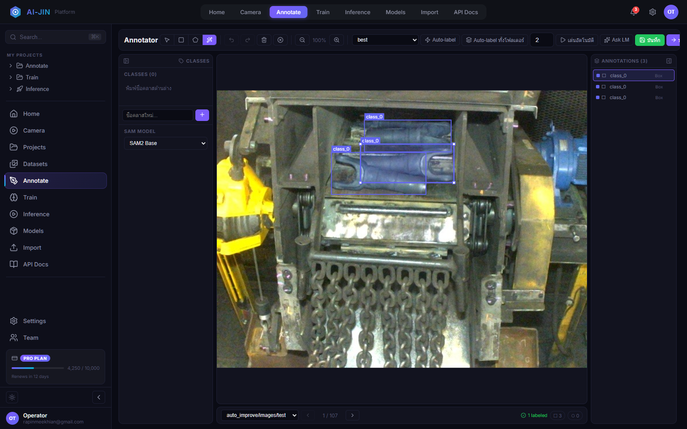
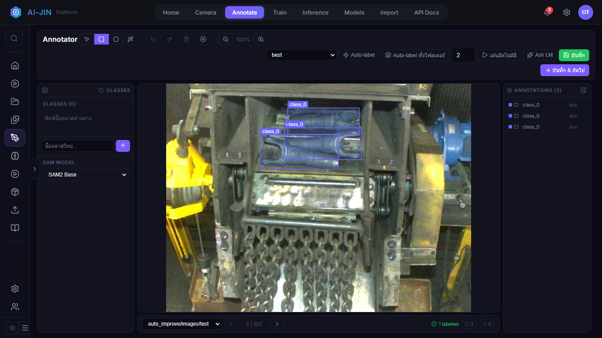

# คู่มือการ Label / Annotate

**ระบบ:** Ai-JIN Platform

**หน้าจอ:** `http://localhost:8501/annotator`

**ฉบับ:** 1.0 - 22 กรกฎาคม 2026

## 1. เป้าหมาย

สร้าง YOLO labels ที่ถูกต้องและสม่ำเสมอสำหรับ Train, Val และ Test โดยรองรับ Box, Polygon, Auto-label, SAM และ LM Assistant

> สถานะปัจจุบันมี label 5 จาก 1,249 ภาพ โดยทั้งหมดอยู่ใน Test และ Train มี label 0/1,015 ภาพ จึงต้อง Label ก่อนเริ่ม Train

## 2. ส่วนประกอบหน้าจอ

- Toolbar: Select, Box, Polygon, SAM Auto, Undo, Redo, Delete และ Zoom
- Classes: สร้าง/เลือกชื่อคลาสและเลือก SAM model
- Canvas: วาดและตรวจ annotation บนภาพจริง
- Annotations: เลือก เปลี่ยน class หรือลบ annotation
- Folder navigation: เลือก Train/Val/Test และเปลี่ยนภาพ
- Actions: Auto-label, Auto-label ทั้งโฟลเดอร์, Ask LM, บันทึก และบันทึก & ถัดไป
- Sidebar slide: ปุ่มลูกศรกลางขอบซ้ายใช้เก็บ/แสดงเมนู และระบบจำสถานะไว้ใน browser

หน้าจอ 320-700 px จะแสดง Classes, Canvas และ Annotations เรียงลงด้านล่างและเลื่อนได้ ส่วนจอใหญ่ toolbar จะขึ้นบรรทัดใหม่อัตโนมัติ จึงไม่มีปุ่มถูกตัดด้านขวา

## 3. ลำดับงานที่แนะนำ

1. เลือก `auto_improve/images/train`
2. สร้าง class ให้ตรงกับชิ้นงาน
3. วาด Box/Polygon หรือใช้ Auto-label/SAM
4. ตรวจกรอบทุกชิ้น
5. กด **บันทึก & ถัดไป**
6. ทำ Train ให้ครบ แล้วทำ Val
7. ทำ Test หลังนิยาม class คงที่แล้ว

ห้าม Label ใน `split_quarantine` เพราะไม่ใช่ active dataset

## 4. วาดและปรับกรอบ Box

1. เลือก class
2. กด **Box (B)**
3. ลากจากมุมหนึ่งไปอีกมุมหนึ่งให้ครอบชิ้นงาน
4. กด **Select (V)**
5. คลิกในกรอบเพื่อเลือก
6. ลากภายในกรอบเพื่อย้ายทั้งกรอบ
7. ลากจุดจับสีขาวที่มุม NW/NE/SW/SE เพื่อปรับขนาด
8. กด `Ctrl+Z` หากต้องย้อนการลากหนึ่งครั้ง

กรอบต้องชิดขอบชิ้นงาน ไม่กินพื้นหลังมากเกินไป และไม่ตัดส่วนสำคัญของชิ้นงาน

## 5. Polygon

1. กด **Polygon (P)**
2. คลิกตามแนวขอบชิ้นงานอย่างน้อย 3 จุด
3. คลิกจุดแรกหรือดับเบิลคลิกเพื่อปิดรูป
4. ใช้ Select เพื่อตรวจจุดและใช้ Delete หากต้องวาดใหม่

ใช้ Polygon เมื่อรูปร่างไม่เหมาะกับสี่เหลี่ยม แต่ต้องรักษารูปแบบ label ให้สอดคล้องกับชนิดโมเดลที่จะ Train

## 6. SAM ร่วมกับการตีกรอบ

### SAM2 / SAM v1

1. เลือก SAM Model ทางซ้าย
2. กด **SAM Auto (S)**
3. คลิกภายในชิ้นงานหนึ่งจุด
4. ตรวจเส้น Preview สีม่วง
5. กด **ใช้งาน** เพื่อเพิ่ม Polygon หรือ **ทิ้ง** เพื่อยกเลิก

### SAM3 Concept

1. เลือก **SAM 3 (Concept)**
2. ใส่คำอธิบาย object หรือเลือก rough box
3. ใช้ Segment by Concept หรือค้นหาจากกรอบที่เลือก
4. ตรวจทุกผลลัพธ์ก่อนบันทึก

SAM ช่วยหาแนวขอบ แต่ผู้ปฏิบัติงานต้องเป็นผู้ยืนยัน class และคุณภาพสุดท้าย

## 7. Auto-label และ LM

- **Auto-label:** ใช้โมเดลที่เลือกกับภาพปัจจุบัน
- **Auto-label ทั้งโฟลเดอร์:** ใช้กับทั้ง folder ต้องสุ่มตรวจอย่างเข้มงวด
- **เล่นอัตโนมัติ:** detect, รอตามเวลาที่ตั้ง, save และไปภาพถัดไป
- **Ask LM:** เสนอวัตถุที่ขาดหรือปรับกรอบเดิม ใช้เมื่อ LM Status เชื่อมต่อแล้ว

ห้ามถือว่าผล Auto-label ถูกต้องโดยอัตโนมัติ ต้องตรวจ false positive, false negative, class และกรอบทุกครั้ง

## 8. Save และคุณภาพ

- **บันทึก:** เขียนภาพปัจจุบัน
- **บันทึก & ถัดไป:** เขียนแล้วเปิดภาพถัดไป
- Labels ถูกเก็บคู่กับภาพใน `dataset/auto_improve/labels/<split>`
- Box บันทึกเป็น `class cx cy width height` แบบ normalized
- Polygon บันทึกเป็น `class x1 y1 x2 y2 ...`

Checklist ต่อภาพ:

- [ ] ครบทุกชิ้นงาน
- [ ] ไม่มีกรอบซ้ำ
- [ ] class ถูกต้อง
- [ ] กรอบชิดชิ้นงาน
- [ ] ไม่มีกรอบออกนอกภาพ
- [ ] ไม่มี annotation บนเงา/แสงสะท้อนที่ไม่ใช่วัตถุ
- [ ] กด Save แล้วตัวนับ labeled เปลี่ยน

## 9. การแก้ปัญหา

| อาการ | วิธีแก้ |
|---|---|
| Save 500 | ตรวจ log, path และ permission ใต้ `D:\Ai-JIN_Platform\dataset` |
| Classes (0) แต่มี class_0 | สร้างชื่อ class ที่ถูกต้องและกำหนด annotation ใหม่ |
| SAM ไม่พบวัตถุ | คลิกจุดกลางชิ้นงาน เปลี่ยน SAM model หรือวาด Box เอง |
| SAM model not found | ตรวจไฟล์ model ใต้ `D:\Ai-JIN_Platform\models` |
| Auto-label ผิดจำนวนมาก | เปลี่ยน base model/confidence และตรวจด้วยมือ |
| ปรับกรอบผิด | กด `Ctrl+Z` ก่อนเปลี่ยนภาพ |
| Label ไม่ขึ้นหลังเปิดใหม่ | ตรวจว่า Save สำเร็จและเลือก folder/split เดิม |

## 10. เกณฑ์ส่งต่อให้ Train

- Train และ Val มี label coverage เพียงพอ
- Class names ตรงกันทุก split
- สุ่มตรวจอย่างน้อยทุก class และทุกสภาพแสง
- ไม่ใช้ quarantine เป็นข้อมูล Train
- สร้าง `data.yaml` หลังตรวจ labels
- ทีม QA อนุมัติชุดข้อมูลก่อนเริ่ม Train

## 11. ปุ่มสไลด์เมนูและพื้นที่ทำงาน

1. กดปุ่มลูกศรที่กึ่งกลางขอบ sidebar เพื่อเก็บเมนู
2. พื้นที่ Canvas จะขยายจาก sidebar 260 px เหลือแถบไอคอน 68 px
3. กดลูกศรอีกครั้งเพื่อแสดงเมนูเต็ม
4. สถานะถูกเก็บใน `localStorage` และคงอยู่หลัง Reload

