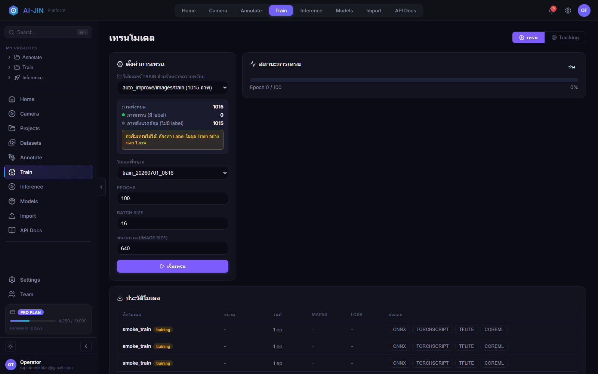
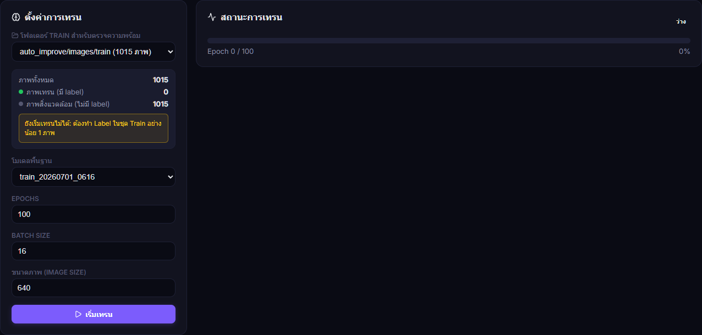
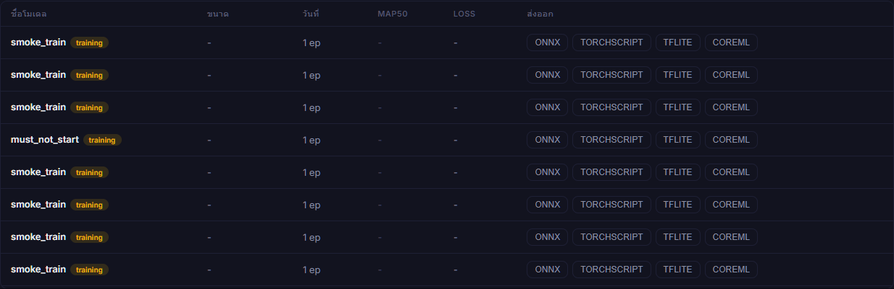

# คู่มือการ Train และส่งออกโมเดล

**ระบบ:** Ai-JIN Platform

**หน้าจอ:** `http://localhost:8501/training`

**ฉบับ:** 1.0 - 22 กรกฎาคม 2026

## 1. สถานะก่อนเริ่ม

ชุดข้อมูล active ถูกแบ่งเป็น Train 1,015 ภาพ, Val 127 ภาพ และ Test 107 ภาพ แต่ขณะจัดทำคู่มือ Train มี label 0/1,015 ภาพ จึงยังเริ่มเทรนไม่ได้ ปุ่ม **เริ่มเทรน** จะถูกปิดทั้งใน UI และ backend local runner จะปฏิเสธคำสั่งที่ไม่มี label



## 2. เงื่อนไขความพร้อม

- เลือกได้เฉพาะ `auto_improve/images/train`
- ต้องมีไฟล์ label ที่ไม่ว่างอย่างน้อย 1 ไฟล์คู่กับภาพ Train
- ควรทำ Label ให้ครอบคลุมทุก class และสภาพแวดล้อมก่อนเริ่มจริง
- `data.yaml` ต้องมี `train`, `val`, `test`, `nc` และ `names` ถูกต้อง
- ห้ามใช้ไฟล์ใต้ `split_quarantine` เป็น active dataset
- ตรวจว่า Train/Val/Test ไม่มี exact duplicate ข้าม split



## 3. ตั้งค่าการเทรน

1. เปิดเมนู **Train**
2. ตรวจโฟลเดอร์ Train และจำนวนภาพที่มี label
3. เลือกโมเดลพื้นฐาน เช่น YOLOv8n สำหรับทดสอบ หรือโมเดลที่เหมาะกับ GPU/ความแม่นยำเป้าหมาย
4. กำหนด Epochs, Batch Size และ Image Size
5. ระบุ Project หากต้องการผูกประวัติกับโครงการ
6. กด **เริ่มเทรน** เมื่อ warning หายและปุ่มพร้อมใช้งาน

ค่าตั้งต้นแนะนำสำหรับ smoke test คือ 1-5 epochs, batch ตาม VRAM และ imgsz 640 ส่วน production run ให้ปรับตามขนาดวัตถุและผล validation

## 4. Dataset ที่ส่งเข้า runner

หน้า Train ส่ง `data=/dataset/auto_improve/data.yaml` อย่างชัดเจน ไม่ได้ใช้ folder dropdown เป็น dataset root โดยตรง เพราะ Ultralytics ต้องอ่าน Train/Val/Test จาก YAML เดียวกัน

เส้นทางหลัก:

```text
dataset/auto_improve/
  data.yaml
  images/train  images/val  images/test
  labels/train  labels/val  labels/test
```

ชื่อไฟล์ภาพและ label ต้องตรงกัน เช่น `part001.jpg` คู่กับ `part001.txt`

## 5. ติดตามสถานะ

- Status: idle, training, completed หรือ error
- Progress: epoch ปัจจุบันและเปอร์เซ็นต์
- Metrics: loss, mAP50 และค่าที่ runner ส่งกลับ
- Log: ข้อความจาก local/remote runner
- ห้ามปิดบริการระหว่างเขียน weights

หาก training service ที่ตั้งค่าไว้ offline ระบบจะใช้ local Ultralytics runner และแสดง `runner: local`

## 6. ประวัติและ Export



หลังเทรนสำเร็จ ให้ตรวจ run name, ขนาด, epochs และ metrics ก่อนเลือกส่งออก:

- ONNX: ใช้กับ runtime ทั่วไปและ TensorRT workflow
- TorchScript: ใช้ใน PyTorch deployment
- TFLite: ใช้กับอุปกรณ์ edge/mobile ที่รองรับ
- CoreML: ใช้บน Apple platform

เก็บ `best.pt`, `results.csv`, `data.yaml`, split manifest และค่าตั้งเทรนร่วมกันเพื่อให้ทำซ้ำได้

## 7. Validation และ Test

1. เลือก checkpoint ที่ดีที่สุดจาก validation metric
2. รัน validation ด้วย Val โดยไม่แก้ threshold ให้เข้ากับ Test
3. ใช้ Test เพียงสำหรับรายงานผลสุดท้าย
4. ตรวจ confusion matrix และตัวอย่าง false positive/false negative แยกตาม workpiece
5. ทดสอบ inference กับภาพจริงจาก Camera ก่อน promote

## 8. การใช้ปุ่มสไลด์ Sidebar

กดลูกศรกลางขอบ sidebar เพื่อย่อจาก 260 px เหลือ 68 px และเพิ่มพื้นที่กราฟ/ตาราง ระบบจำสถานะหลัง Reload บนจอไม่เกิน 1100 px sidebar จะถูกซ่อนและเมนูทั้งหมดแสดงใน topbar 4 คอลัมน์

## 9. การแก้ปัญหา

| อาการ | วิธีแก้ |
|---|---|
| ปุ่มเริ่มเทรนถูกปิด | ทำ Label ใน `images/train` และ Reload สถิติ |
| เตือน 0 labels | ตรวจไฟล์ `labels/train/*.txt` ว่าชื่อคู่ภาพและมีข้อมูล |
| data.yaml ไม่พบ | สร้างใหม่จาก Import และตรวจ mount `/dataset` |
| Remote offline | ใช้ local runner หรือเปิด service ที่กำหนดใน `YOLO_TRAIN_URL` |
| CUDA out of memory | ลด Batch หรือ Image Size |
| Metric ไม่ดี | ตรวจ class, กรอบ, leakage และความสมดุล workpiece |
| Export ไม่สำเร็จ | ตรวจ dependency ของ format และไฟล์ `best.pt` |

## 10. Checklist ก่อนอนุมัติโมเดล

- [ ] Train และ Val มี label coverage ตามเกณฑ์ QA
- [ ] ไม่มี duplicate leakage ข้าม split
- [ ] `data.yaml` และ class order ถูกต้อง
- [ ] บันทึก model, epochs, batch, imgsz และ seed
- [ ] Validation/Test report ผ่านเกณฑ์
- [ ] ทดสอบภาพจาก Camera จริง
- [ ] ส่งออก format ที่ runtime ใช้และทดสอบโหลดสำเร็จ
- [ ] เก็บหลักฐาน run และผู้อนุมัติ
